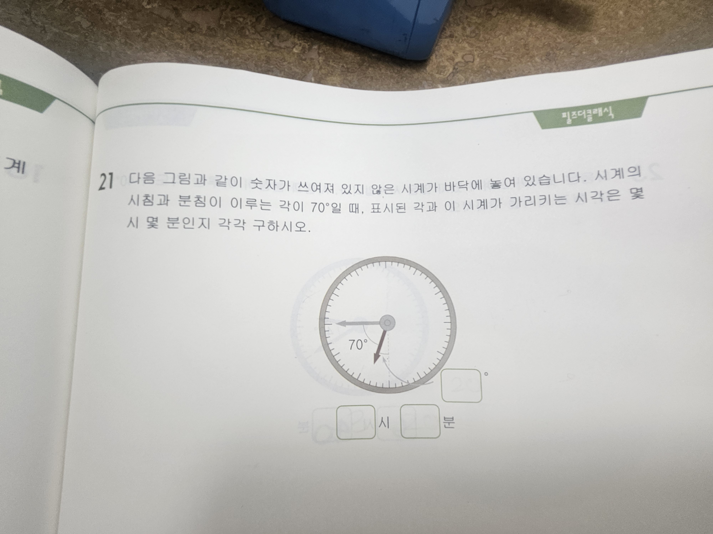

# 필즈더클래식 21번 · 시계 각도 문제 풀이 (초등 3학년용)

📄 **웹으로 보기(배포 페이지):** https://heekeunlee.github.io/fields_math/

숫자가 없는 시계 문제를 초등학교 3학년도 이해할 수 있게 쉽게 설명한 풀이입니다.

---

## 📖 문제 (21번)

숫자가 쓰여 있지 않은 시계가 바닥에 **비뚤게** 놓여 있어요.
시침(짧은 바늘)과 분침(긴 바늘)이 이루는 각이 **70°** 일 때,

- ① **표시된 각**
- ② 시계가 가리키는 **시각(몇 시 몇 분)**

을 각각 구하세요.

---

## 🧠 먼저 알아두기 (시계의 비밀)

- **분침(긴 바늘)** 은 60분 동안 한 바퀴(360°)를 돌아요 → **1분에 6°**
- 숫자와 숫자 사이 한 칸 = **30°** = 시간으로 **5분**
- **시침(짧은 바늘)** 은 느림보! 60분(1시간) 동안 겨우 한 칸(30°)만 움직여요
  → 30분이면 15°, **40분이면 20°** 움직여요

---

## ① 표시된 각 구하기

- 그림에서 **분침**은 옆으로 반듯이 누워 있어요 (가로 —)
- **점선**은 아래로 반듯이 내려가요 (세로 |)
- 가로와 세로가 만나면 **직각 = 90°**
- 두 바늘이 이루는 각은 **70°**
- 그러니까 시침과 점선 사이(표시된 각) = **90° − 70° = 20°**

> **① 표시된 각 = 20°**

---

## ② 몇 시 몇 분일까?

### 먼저 '몇 분'인지 찾기
- 시침은 한 칸(30°)을 지나는 데 60분이 걸려요
- 지금 시침은 숫자 자리에서 **20°** 움직여 있어요
- 30°가 60분이니까, 20°는 → 60분 × (20 ÷ 30) = **40분**

➡️ 지금은 **△△시 40분** (분침도 40분 자리인 '8' 자리를 가리켜요)

### 이제 '몇 시'인지 찾기
- 분침은 40분 자리(숫자 **8**)에 있어요
- 시침은 분침에서 **70°** 떨어져 있어요
- 한 칸이 30°니까 70° = 30° + 30° + 10° = **두 칸하고 조금 더**
- 8 자리에서 두 칸 반쯤 돌아가면 시침은 **5와 6 사이**(5를 20° 지난 자리)

➡️ 그래서 지금은 **5시**

> **② 시각 = 5시 40분**

---

## ✅ 검산

5시 40분일 때 두 바늘의 위치:

| 바늘 | 위치 | 각도 |
|------|------|------|
| 분침 | 40분 (숫자 8) | 40 × 6° = **240°** |
| 시침 | 5시(150°) + 40분(20°) | **170°** |

→ 두 바늘 사이 각 = 240° − 170° = **70°** ✓ 문제와 딱 맞아요!

---

## 🎯 최종 정답

| 구분 | 답 |
|------|-----|
| ① 표시된 각 | **20°** |
| ② 시각 | **5시 40분** |
